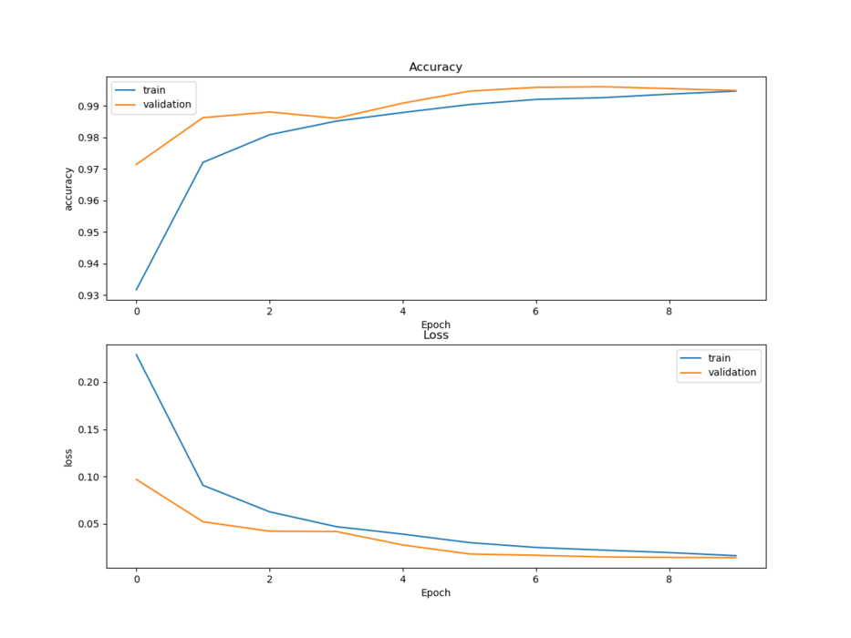
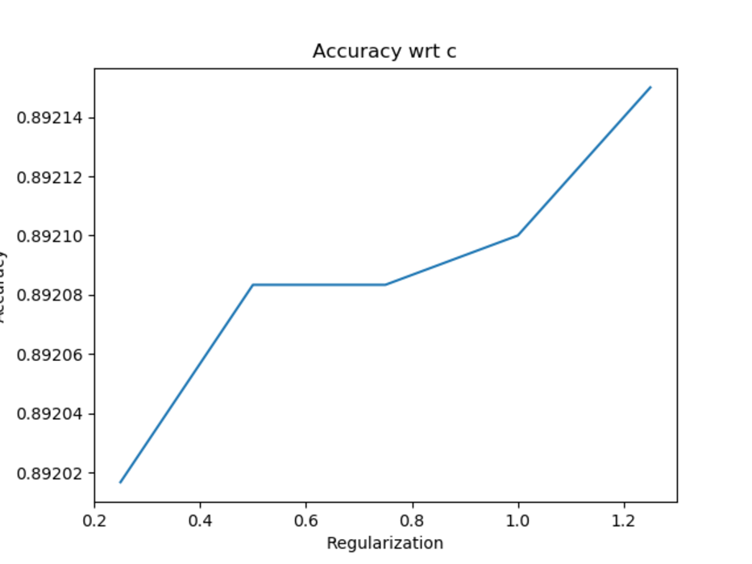
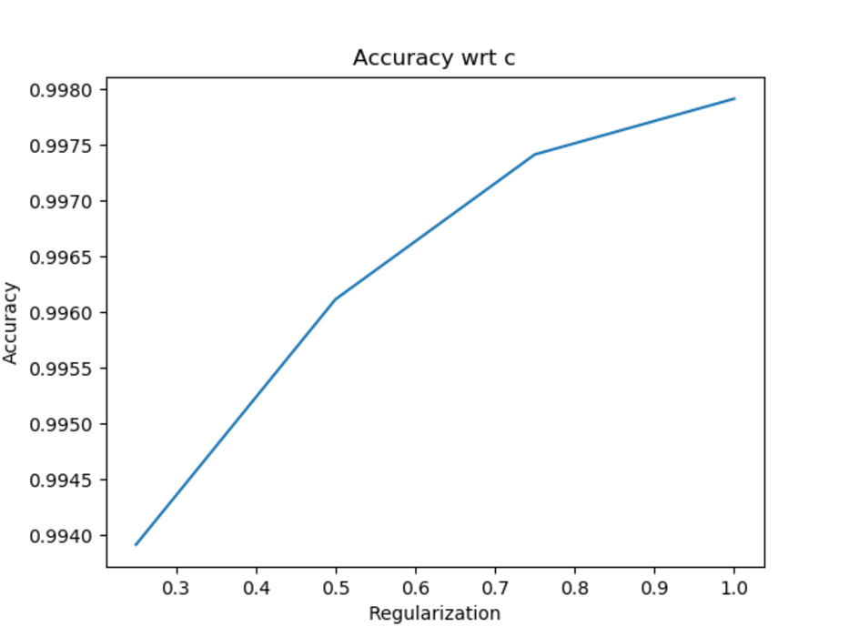

# Handwritten-digits-Classification
## Overview
Hand written digit recognition using Logistic Regression, kernel SVM, Deep Neural Network (Lenet-5 architecture) with PCA/LDA dimensionality reduction for MINST dataset.

## To run the code
### Deep Learning
```bash
python3 main.py --Method Lenet
```
-  Parameters  
    - Method - Classifiers. *Default :- 'Lenet'*

### Logistic Regression
```bash
python3 main.py --Method LR --DimRed LDA 
```
-  Parameters  
    - Method - Classifiers. *Default :- 'Lenet'*
    - DimRed - Dimensionality Reduction technique. Option : 'PCA/LDA' *Default :- 'PCA'* 

### SVM
```bash
python3 main.py --Method SVM --DimRed LDA --Kernel Polynomial
```
-  Parameters  
    - Method - Classifiers. *Default :- 'Lenet'*
    - DimRed - Dimensionality Reduction technique. Option : 'PCA/LDA' *Default :- 'PCA'* 
    - DimRed - kernel for Kernel SVM. Option : 'Polynomial/RBF' *Default :- 'Linear'* 

## Results
### LeNet-5 
Accuracy | Confusion Matrix
:-:|:-:
 |  

### Logistic Regression

Dim Red. | Accuracy | Confusion
:-:|:-:|:-:
| PCA | |  
| LDA | |  

### SVM

Kernel | PCA | LDA
:-:|:-:|:-:
| Linear     | |  
| Polynomial | |  
| RBF        | |  

